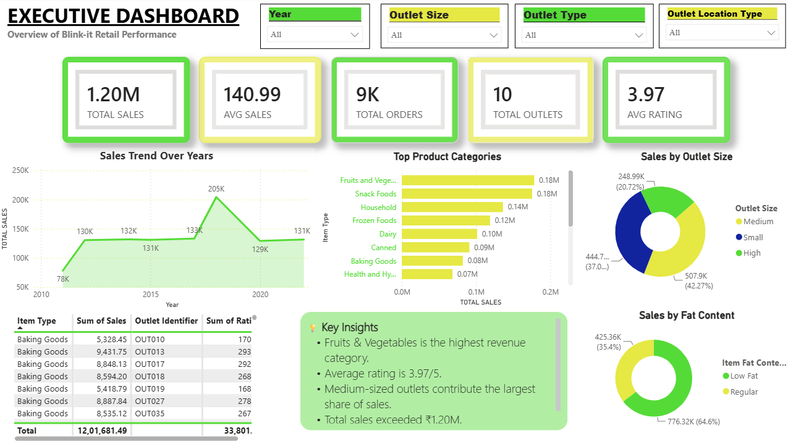
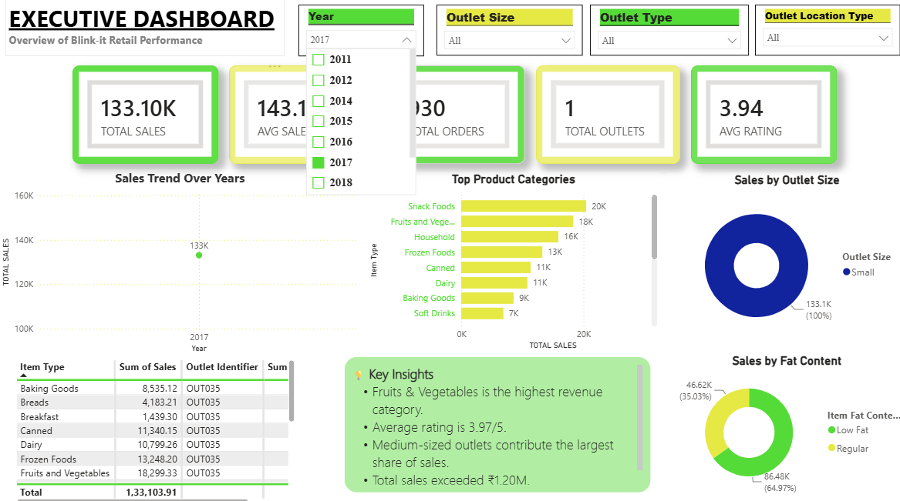
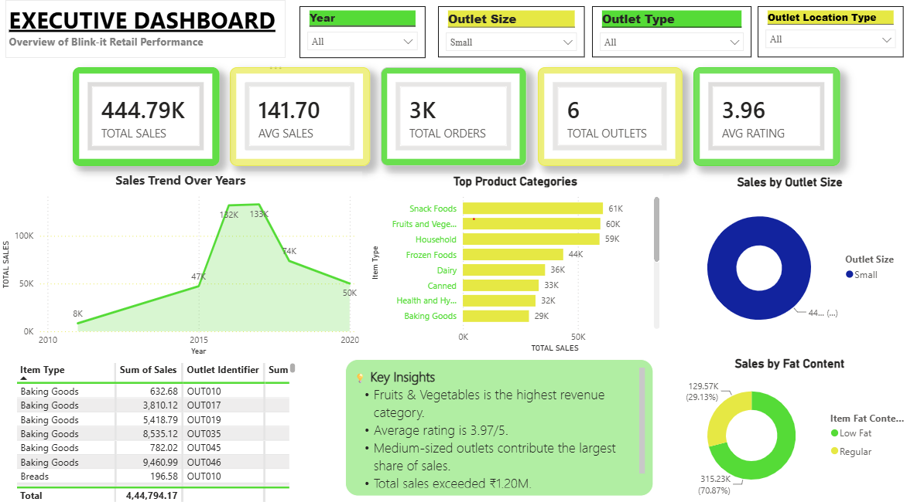
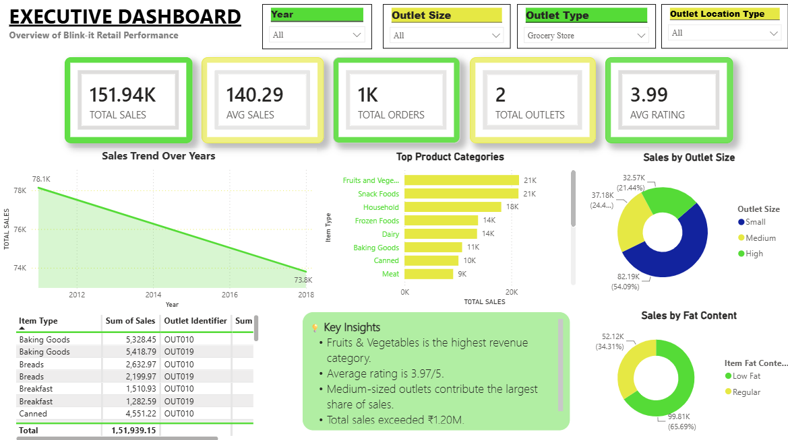
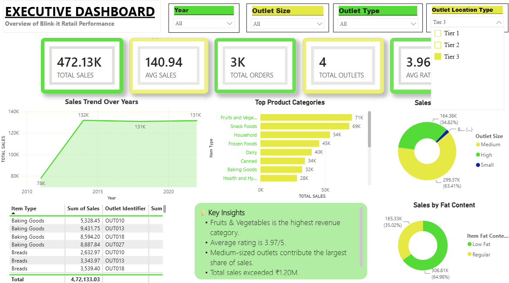
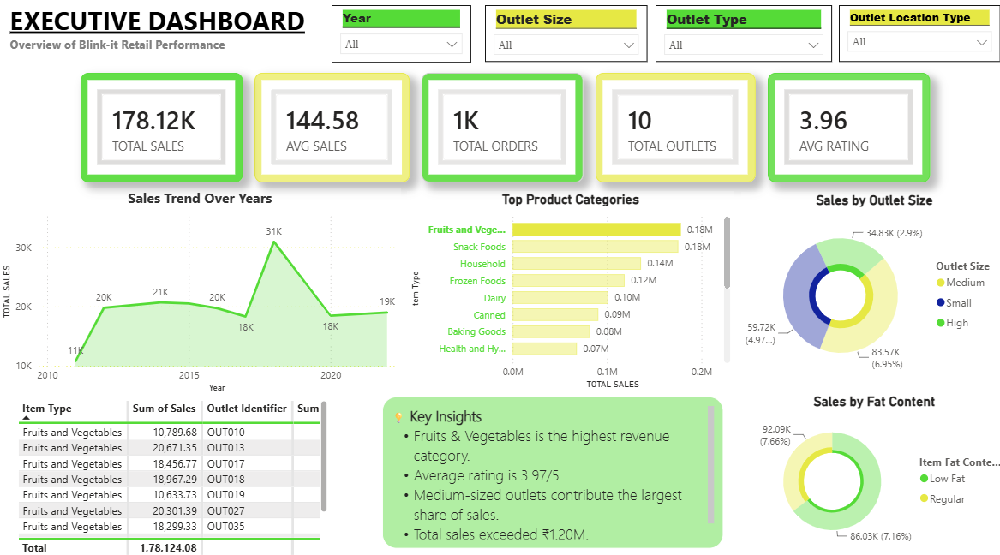
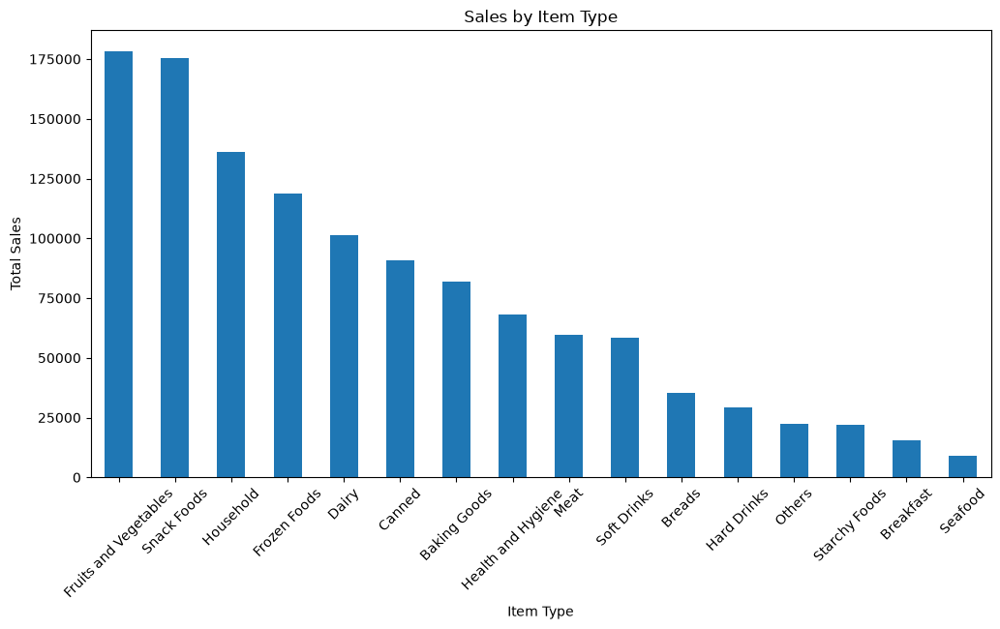
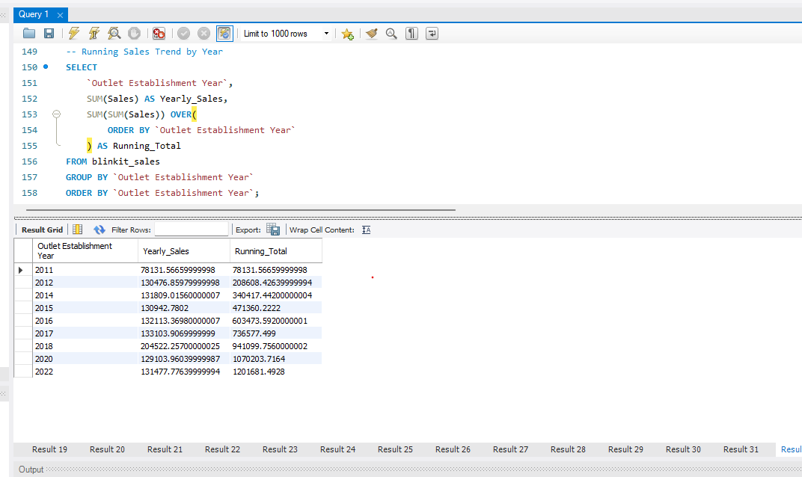

# 🛒 Blinkit Retail Intelligence 

> **An end-to-end Retail Analytics project that transforms raw Blinkit sales data into actionable business insights using Python, MySQL, SQL, Power BI, and (upcoming) Apache Kafka for real-time data streaming.**


---

# 📌 Project Overview

Retail businesses generate massive amounts of transactional data every day. This project demonstrates how raw retail data can be transformed into meaningful business insights through a complete analytics pipeline.

The project covers the complete workflow from **data cleaning**, **feature engineering**, and **SQL analysis** to **interactive Power BI dashboards**, enabling data-driven decision-making for retail operations.

---

# 🎯 Project Objectives

- Clean and preprocess retail sales data.
- Perform Exploratory Data Analysis (EDA).
- Store processed data in MySQL.
- Write business-focused SQL queries.
- Build an executive Power BI dashboard.
- Simulate real-time retail analytics using Apache Kafka *(In Progress)*.

---

# 🏗️ Project Architecture

```text
                    Blinkit Sales Dataset (.xlsx)
                                │
                                ▼
                    Python Data Cleaning (Pandas)
                                │
                                ▼
                    Feature Engineering & EDA
                                │
                                ▼
                         MySQL Database
                                │
                   Business SQL Analysis
                                │
                                ▼
                    Power BI Executive Dashboard
                                │
                                ▼
                 Business Insights & Decision Making

                (Upcoming)
Python Producer → Apache Kafka → Python Consumer → MySQL
```

---

# 🚀 Tech Stack

| Category | Technologies |
|----------|--------------|
| Programming | Python |
| Data Processing | Pandas, NumPy |
| Database | MySQL |
| Query Language | SQL |
| Data Visualization | Power BI |
| Notebook | Jupyter Notebook |
| Version Control | Git, GitHub |
| Streaming (Upcoming) | Apache Kafka |

---

# 📂 Project Structure

```text
Blinkit-Retail-Intelligence
│
├── data/
│   ├── raw/
│   └── cleaned/
│
├── database/
│   └── load_to_mysql.py
│
├── notebooks/
│   ├── 01_data_cleaning.ipynb
│   └── 02_eda.ipynb
│
├── powerbi/
│   └── Blinkit_Retail_Analytics.pbix
│
├── screenshots/
│   ├── dashboard_overview.png
│   ├── filter_year.png
│   ├── filter_outlet_size.png
│   ├── filter_outlet_type.png
│   ├── filter_location.png
│   ├── category_analysis.png
│   ├── sql_analysis.png
│   └── eda_python.png
│
├── sql/
│   └── business_queries.sql
│
├── requirements.txt
├── README.md
└── .gitignore
```

---

# 📊 Dashboard Features

✔ Executive KPI Cards

- Total Sales
- Average Sales
- Total Orders
- Average Customer Rating

✔ Interactive Visualizations

- Sales Trend
- Sales by Item Type
- Outlet Performance
- Outlet Size Analysis
- Outlet Location Analysis
- Category-wise Sales
- Customer Rating Analysis

✔ Interactive Filters

- Outlet Type
- Outlet Size
- Outlet Location
- Establishment Year

---

# 📸 Dashboard Preview

## Executive Dashboard



---

## Filter by Establishment Year



---

## Filter by Outlet Size



---

## Filter by Outlet Type



---

## Filter by Outlet Location



---

## Category Analysis



---

# 🐍 Exploratory Data Analysis

Python was used for data preprocessing and exploratory data analysis before loading the cleaned dataset into MySQL.

Example visualization:



---

# 🗄️ SQL Business Analysis

The project includes **15+ business-oriented SQL queries**, including:

- Overall Business KPIs
- Product Category Analysis
- Outlet Performance
- Customer Rating Analysis
- Sales Contribution Analysis
- Ranking using Window Functions
- Running Sales Trend

Example:



---

# 📈 Key Business Insights

- Identified the highest revenue-generating product categories.
- Compared outlet performance across different outlet types.
- Evaluated sales contribution by outlet size and location.
- Measured customer satisfaction using average ratings.
- Analyzed historical sales trends across establishment years.
- Ranked product categories using SQL window functions.

---

# ⚙️ How to Run the Project

### Clone Repository

```bash
git clone https://github.com/sanyuktaraut09/Blinkit-Retail-Intelligence.git
```

### Install Dependencies

```bash
pip install -r requirements.txt
```

### Run Data Cleaning

```bash
python notebooks/01_data_cleaning.ipynb
```

### Load Data into MySQL

```bash
python database/load_to_mysql.py
```

### Execute SQL Queries

Open MySQL Workbench and run:

```
sql/business_queries.sql
```

### Open Dashboard

Launch:

```
powerbi/Blinkit_Retail_Analytics.pbix
```

---

# 🔮 Future Enhancements

- Apache Kafka Streaming Pipeline
- Real-Time Dashboard Refresh
- Automated ETL Pipeline
- Docker Deployment
- Cloud Deployment (AWS/Azure)
- Machine Learning-based Sales Forecasting

---

# ⭐ Project Highlights

✔ End-to-End Analytics Pipeline

✔ Business-Oriented SQL Analysis

✔ Executive Power BI Dashboard

✔ MySQL Database Integration

✔ Interactive Filtering & Drill-down

✔ Professional GitHub Documentation

✔ Real-Time Streaming (Coming Soon)

---

# 👩‍💻 Author

**Sanyukta Raut**


