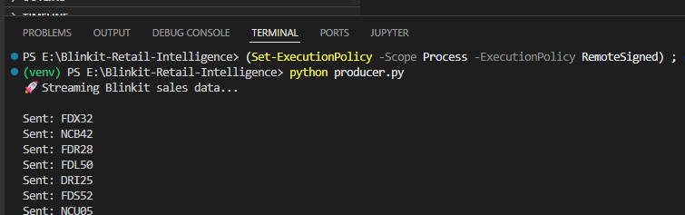
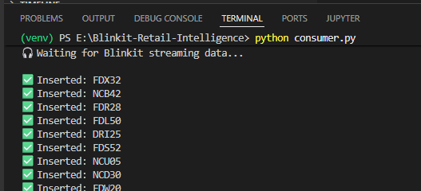
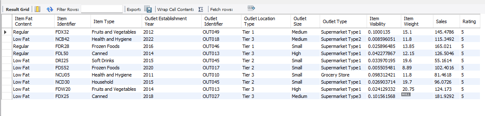
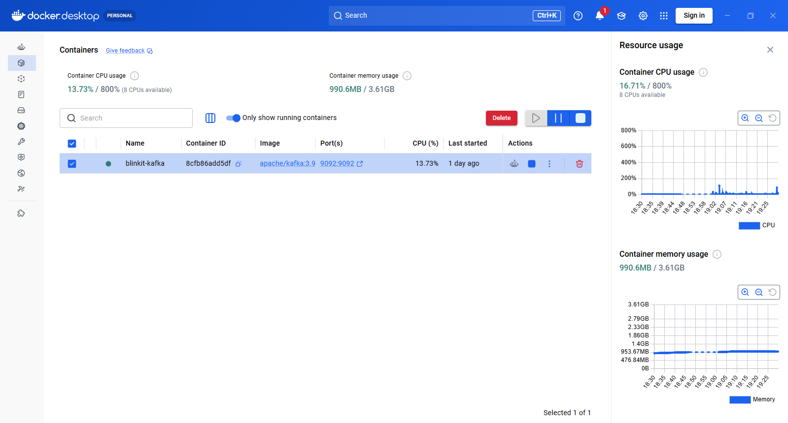

# 🛒 Blinkit Retail Intelligence with Real-Time Kafka Streaming

An end-to-end Retail Intelligence project that transforms raw Blinkit grocery sales data into actionable business insights using **Python, MySQL, SQL, Power BI, Apache Kafka, and Docker**.

The project demonstrates both **batch analytics** and **real-time streaming**, where retail sales are streamed using Apache Kafka and stored into MySQL for further analysis.

---

# 🚀 Features

- ✅ Data Cleaning using Pandas
- ✅ Exploratory Data Analysis (EDA)
- ✅ Feature Engineering
- ✅ MySQL Database Integration
- ✅ 15+ Business SQL Queries
- ✅ Interactive Power BI Dashboard
- ✅ Apache Kafka Producer & Consumer
- ✅ Dockerized Kafka Deployment
- ✅ Real-Time Streaming into MySQL

---

# 🏗️ Project Architecture

```text
                    Blinkit Retail Dataset
                             │
                             ▼
              Data Cleaning & Feature Engineering
                     (Python + Pandas)
                             │
                             ▼
                     MySQL Database
                             │
                             ▼
                 Business SQL Analysis
                             │
                             ▼
                 Power BI Dashboard
                             │
──────────────────────────────────────────────────
                Real-Time Streaming Layer
──────────────────────────────────────────────────
                             │
                             ▼
                  Kafka Producer (Python)
                             │
                             ▼
             Apache Kafka (Docker Container)
                             │
                             ▼
                  Kafka Consumer (Python)
                             │
                             ▼
             MySQL Streaming Table
```

---

# 🛠 Tech Stack

- Python
- Pandas
- NumPy
- MySQL
- SQLAlchemy
- PyMySQL
- SQL
- Apache Kafka
- Docker
- Power BI
- Git
- GitHub

---

# 📁 Project Structure

```text
Blinkit-Retail-Intelligence
│
├── data/
│   ├── raw/
│   └── cleaned/
│
├── notebooks/
│
├── sql/
│
├── screenshots/
│
├── producer.py
├── consumer.py
├── load_to_mysql.py
├── requirements.txt
└── README.md
```

---

# 📊 Dashboard Features

- Executive KPI Dashboard
- Sales Trend Analysis
- Category-wise Sales Analysis
- Outlet Performance Analysis
- Interactive Filters
- Business Insights

---

# ⚡ Kafka Streaming Workflow

The project simulates a real-time retail environment.

- Producer streams Blinkit sales records to Kafka.
- Kafka acts as the messaging broker.
- Consumer receives the streaming events.
- Consumer inserts records into MySQL.
- Streamed data can be queried for real-time analytics.

---

# 📷 Screenshots

## Executive Dashboard


---

## Category Analysis


---

## SQL Analysis


---

## Interactive Dashboard Filter


---

## Kafka Producer



---

## Kafka Consumer



---

## MySQL Streaming Table



---

## Dockerized Kafka



---

# 💡 Business Insights

- Analyze sales performance across product categories.
- Compare outlet performance across locations.
- Monitor inventory-related metrics.
- Identify top-performing product segments.
- Simulate real-time retail transaction ingestion.

---

# 🎯 Learning Outcomes

This project provided practical experience with:

- Data Cleaning
- Exploratory Data Analysis
- SQL Query Writing
- Power BI Dashboard Development
- Apache Kafka
- Docker
- SQLAlchemy
- Real-Time Data Streaming
- Data Engineering Fundamentals

---

# 👩‍💻 Author

**Sanyukta Raut**

- GitHub: https://github.com/sanyuktaraut09